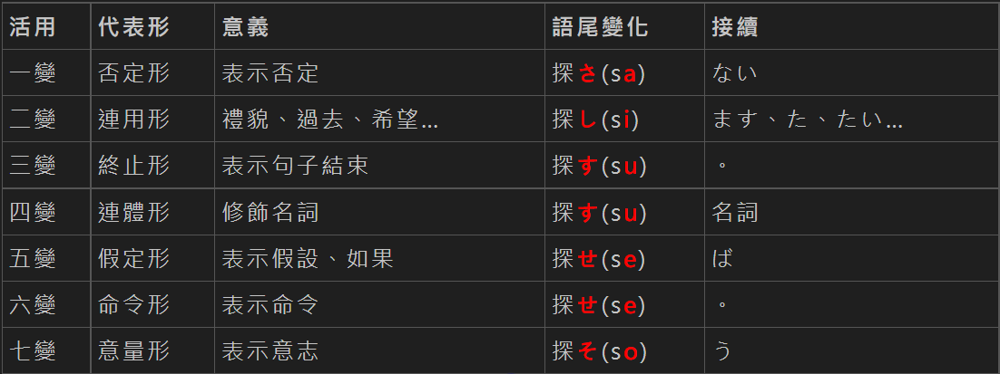

# Japanese_Learning

[形式名詞「の」＋助詞](https://avalon1119.pixnet.net/blog/post/388159592)

---
[授受動詞「くれる」「あげる」「もらう」](https://chobitsnochii.pixnet.net/blog/post/93731168)

> てもらえませんか?  能不能幫我做某事呢(較有禮貌)
> 　例句 : 写真しゃしんを撮とってもらえませんか。
>
> てもらえまか?

---

「声こえ」和「音おと」

>1. 從動物口中所發出的聲音稱為「声」
>2. 碰撞、敲打，或無生物的東西所產生的聲響稱為「音」

---

五段動詞變化

---

上段動詞變化

---

「AにはB」的用法，「對【Aに】部份【做B解說】」
> ●私には子供がいます。（我有小孩。）
> →針對「私に」做出解說，「我」怎麼了，發生什麼事了，擁有什麼東西。
>
>●田中さんには話しました。（向田中說話。）
→針對「田中さんに」做出解說，「對於田中這一個人」做了什麼事，說了什麼話。

---

現在式、未來式

>動詞原形兼具現在式和未來式的功能、且未來式的感覺較強烈，因此，如果要表示特定「現在當下正在做的事情」，一般會使用動詞的「動詞て形＋いる」。
>
>私はご飯を食べます。
>(我要吃飯。）
>
>私はご飯を食べています。
>（我正在吃飯。）

---

